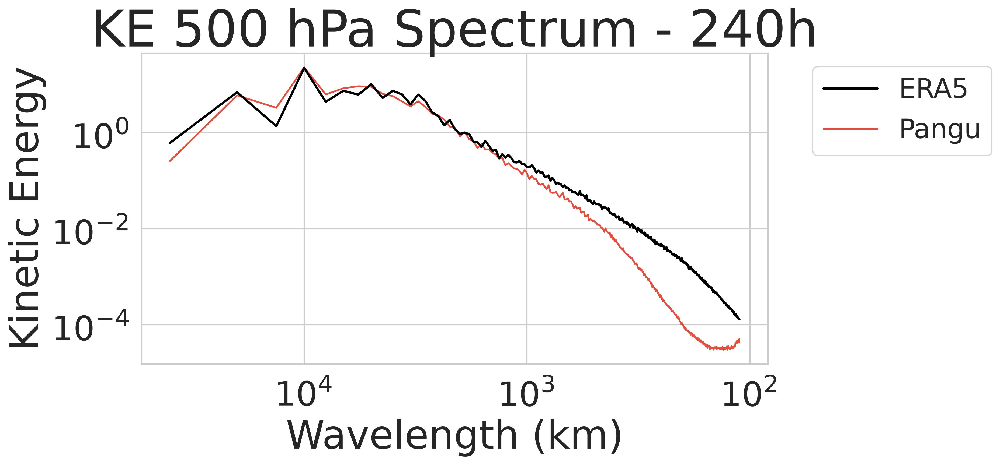

Usage Guide
===========

``physmetrics-weather`` provides both command-line interface (CLI) utilities and a Python object-oriented API for metric calculation and visualization.

.. note::
   **Execution Time Notice**: Evaluating a full 365-day year across multiple forecast lead horizons involves streaming data and computing 3D integrations and spherical harmonic spectra for over 1,000 data slices. A full-year run can take several hours depending on network bandwidth and parallel CPU workers. For quick tests and examples, use ``--dates 2020-01-01 2020-01-02``.

1. Command-Line Interface (CLI)
-------------------------------

Running Metric Evaluation (physmetrics-run)
~~~~~~~~~~~~~~~~~~~~~~~~~~~~~~~~~~~~~~~~~~~

The ``physmetrics-run`` command streams model predictions and reference datasets, evaluating all physical metrics.

.. code-block:: bash

   physmetrics-run [OPTIONS]

Key CLI Options:

* ``--year INTEGER``: Year to evaluate (default: 2022).
* ``--dates STRING [STRING ...]``: Specific ISO dates to evaluate (e.g. ``2020-01-01 2020-01-02``).
* ``--month STRING``: Evaluate all days of a month (e.g. ``2020-01``).
* ``--prediction-zarr STRING``: Path or GCS URL to model prediction Zarr dataset.
* ``--ref-zarr STRING``: Path or GCS URL to reference ground truth Zarr dataset.
* ``--lead-times STRING``: Comma-separated list of target lead times (default: ``12h,5d,10d``).
* ``--workers INTEGER``: Number of parallel worker processes (default: 4).
* ``--output-dir PATH``: Output directory path for generated CSV files (default: ``./results``).
* ``--output PATH``: Custom destination CSV file path.
* ``--mode {joint,ref,prediction,model}``: Evaluation mode (default: ``joint``).

CLI Example:

.. code-block:: bash

   physmetrics-run \
      --model pangu \
      --prediction-zarr gs://weatherbench2/datasets/pangu/2018-2022_0012_0p25.zarr \
      --ref-zarr gs://weatherbench2/datasets/era5/1959-2023_01_10-wb13-6h-1440x721_with_derived_variables.zarr \
      --dates 2020-01-01 2020-01-02 \
      --workers 4 \
      --output-dir ./results

Generating Visualizations (physmetrics-plot)
~~~~~~~~~~~~~~~~~~~~~~~~~~~~~~~~~~~~~~~~~~~~

The ``physmetrics-plot`` command reads long-format CSV files and renders publication-ready plots.

.. code-block:: bash

   physmetrics-plot --results-dir ./results --outdir ./plots

This generates a set of diagnostic plots in the output directory, including:

* **Time Series Diagnostics**: Global drift of mass and energy (e.g., ``ts_dry_mass_Eg.png``) and balance errors (e.g., ``ts_geostrophic_rmse.png``).
* **Summary Tables**: Tables summarizing conservation, balance, and spectral metrics across lead times (e.g., ``neurips_table_balance.png``).
* **Energy Spectra**: Energy vs. wavelength for each computed spectrum variable at target lead times (e.g., ``spectra_ke_500_120h.png``).
* **Lapse Rate Distributions**: Regional lapse rate histograms (e.g., ``lapse_rate_tropics.png``).

Example Outputs
~~~~~~~~~~~~~~~

.. image:: plots/ts_dry_mass_Eg.png
   :alt: Global Dry Air Mass Drift
   :width: 80%
   :align: center

.. image:: plots/neurips_table_conservation_variability.png
   :alt: Conservation and Variability Summary
   :width: 100%
   :align: center

2. Python API Usage
-------------------

Running Evaluation Pipelines
~~~~~~~~~~~~~~~~~~~~~~~~~~~~

Use ``EvaluationConfig`` and ``EvaluationPipeline`` to run evaluation workflows programmatically:

.. code-block:: python

   from pathlib import Path
   from physmetrics_weather import EvaluationConfig, EvaluationPipeline

   # 1. Define configuration settings
   config = EvaluationConfig(
       dates=["2020-01-01", "2020-01-02"],
       prediction_zarr=" gs://weatherbench2/datasets/pangu/2018-2022_0012_0p25.zarr",
       model_name="pangu",
       output_csv=Path("./results/physics_evaluation_pangu_2020.csv"),
       workers=4,
   )

   # 2. Execute pipeline
   pipeline = EvaluationPipeline(config)
   df = pipeline.run()

   print(f"Evaluated {len(df)} metric records.")

Rendering Diagnostic Figures
~~~~~~~~~~~~~~~~~~~~~~~~~~~~

Use ``PlotterConfig`` and ``PhysicsPlotter`` to generate figure plots programmatically:

.. code-block:: python

   from pathlib import Path
   from physmetrics_weather import PlotterConfig, PhysicsPlotter

   # 1. Configure plotter
   config = PlotterConfig(
       results_dir=Path("./results"),
       outdir=Path("./plots"),
       style="whitegrid",
       dpi=300,
       file_format="png",
   )

   # 2. Render plots
   plotter = PhysicsPlotter(config)
   plot_paths = plotter.generate_all()

   for path in plot_paths:
       print(f"Saved plot: {path}")

Generated Figures
-----------------
* ``ts_dry_mass_Eg.png``: Global dry air mass drift timeseries
* ``ts_water_mass_kg.png``: Global water mass drift timeseries
* ``ts_total_energy_J.png``: Global total energy drift timeseries
* ``ts_hydrostatic_rmse.png``: Hydrostatic balance error timeseries
* ``ts_geostrophic_rmse.png``: Geostrophic balance error timeseries
* ``neurips_table_*.png``: Summary tables
* ``spectra_<variable>_*.png``: Energy spectra vs. wavelength for each spectrum variable and target lead
* ``lapse_rate_*.png``: Lapse rate distributions by region
